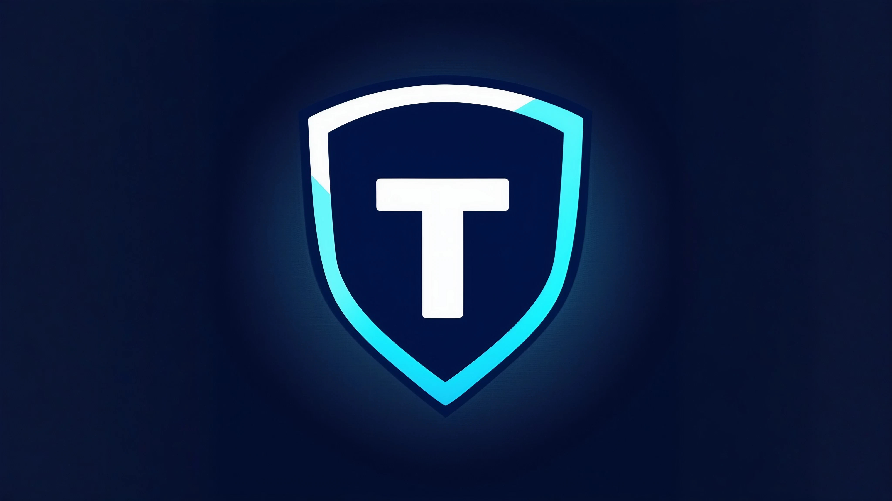

# Tauri + Authy/Aegis = Truthy
(didn't want to call it tauthy or Taegis)

## Badges

 

## Summary
Everything works, db is secured with battletested KDBX storage. App do not take any backups, it's your sole responsibility. 
use strong password. more coming soon
